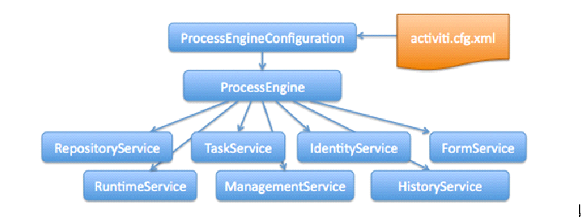

##                                                                                             activiti笔记

### 核心api




### api介绍

#### 1.ProcessEngine

说明：

1)     在Activiti中最核心的类，其他的类都是由他而来。

2)     产生方式：

```java
ProcessEngine processEngine = ProcessEngines.getDefaultProcessEngine();
```

3） 各service的作用

| **RepositoryService**  | **管理流程定义**                 |
| ---------------------- | -------------------------- |
| **RuntimeService****** | **执行管理，包括启动、推进、删除流程实例等操作** |
| **TaskService**        | **任务管理**                   |
| **HistoryService**     | **历史管理(****执行完的数据的管理)**    |
| **IdentityService**    | **组织机构管理**                 |
| FormService            | 一个可选服务，任务表单管理              |
| ManagerService         |                            |

#### 2.ProcessDefinition

流程定义类。可以从这里获得资源文件等。

#### 3.ProcessInstance

代表流程定义的执行实例。一个流程实例包括了所有的运行节点。我们可以利用这个对象来了解当前流程实例的进度等信息。**流程实例就表示一个流程从开始到结束的最大的流程分支**，即一个流程中流程实例只有一个。


### 一、流程部署

#### 1、部署流程定义

```java
RepositoryService 流程部署的核心service

//部署流程
DeploymentBuilder（RepositoryService.createDeployment）部署流程对象
```

#### 2、查询部署对象信息

```java

RepositoryService
/** Query deployment. */
DeploymentQuery createDeploymentQuery();//部署对象信息的查询接口

Deployment（部署对象信息）对应act_re_deployment表
```

#### 3、流程定义信息

```java
RepositoryService
/** Query process definitions. */
ProcessDefinitionQuery createProcessDefinitionQuery();//部署流程定义的信息查询接口

ProcessDefinition（流程定义信息对象） 对应 act_re_procdef 表
```

#### 4、流程定义图

```java
RepositoryService
InputStream getResourceAsStream(String deploymentId, String resourceName);//获取流程定义的流程图的输入流

act_ge_bytearray表
```


### 二、开始走任务

#### 1、启动业务

```java
启动业务service: RuntimeService

/使用给定的键在流程定义的最新版本中启动一个新的流程实例
@param  processDefinitionKey 流程定义的关键字，不能为空。act_re_procdef表中可以看到流程定义的key
@param variables 变量。可以为空
@param businessKey 业务的key
ProcessInstance startProcessInstanceByKey(String processDefinitionKey, String businessKey, Map<String, Object> variables);
```

#### 2、获取任务

```java
List<Task> list = taskService.createTaskQuery()//
					.taskAssignee(assignee)//指定个人任务查询， 关键
					.orderByTaskCreateTime().asc()//
					.list();


//使用任务ID，查询任务对象
Task task = taskService.createTaskQuery()//
    .taskId(taskId)//使用任务ID查询
    .singleResult();
```

获取当前任务完成之后的连线名称

```java
/**二：已知任务ID，查询ProcessDefinitionEntiy对象，从而获取当前任务完成之后的连线名称，并放置到List<String>集合中*/
	@Override
	public List<String> findOutComeListByTaskId(String taskId) {
		//返回存放连线的名称集合
		List<String> list = new ArrayList<String>();
		//1:使用任务ID，查询任务对象
		Task task = taskService.createTaskQuery()//
					.taskId(taskId)//使用任务ID查询
					.singleResult();
		//2：获取流程定义ID
		String processDefinitionId = task.getProcessDefinitionId();
		//3：查询ProcessDefinitionEntiy对象
		ProcessDefinitionEntity processDefinitionEntity = (ProcessDefinitionEntity) repositoryService.getProcessDefinition(processDefinitionId);
		//使用任务对象Task获取流程实例ID
		String processInstanceId = task.getProcessInstanceId();
		//使用流程实例ID，查询正在执行的执行对象表，返回流程实例对象
		ProcessInstance pi = runtimeService.createProcessInstanceQuery()//
					.processInstanceId(processInstanceId)//使用流程实例ID查询
					.singleResult();
		//获取当前活动的id
		String activityId = pi.getActivityId();
		//4：获取当前的活动
		ActivityImpl activityImpl = processDefinitionEntity.findActivity(activityId);
		//5：获取当前活动完成之后连线的名称
		List<PvmTransition> pvmList = activityImpl.getOutgoingTransitions();
		if(pvmList!=null && pvmList.size()>0){
			for(PvmTransition pvm:pvmList){
				String name = (String) pvm.getProperty("name");
				if(StringUtils.isNotBlank(name)){
					list.add(name);
				}
				else{
					list.add("默认提交");
				}
			}
		}
		return list;
	}
```

#### 3.执行任务

```java
Task task = taskService.createTaskQuery()//
						.taskId(taskId)//使用任务ID查询
						.singleResult();
		//获取流程实例ID
		String processInstanceId = task.getProcessInstanceId();
		
		/**
		 * 注意：添加批注的时候，由于Activiti底层代码是使用：
		 * 		String userId = Authentication.getAuthenticatedUserId();
			    CommentEntity comment = new CommentEntity();
			    comment.setUserId(userId);
			  所有需要从Session中获取当前登录人，作为该任务的办理人（审核人），对应act_hi_comment表中的User_ID的字段，不过不添加审核人，该字段为null
			 所以要求，添加配置执行使用Authentication.setAuthenticatedUserId();添加当前任务的审核人
		 * */
		Authentication.setAuthenticatedUserId(SessionContext.get().getName());
		taskService.addComment(taskId, processInstanceId, message);
		
		/**
		 * 2：如果连线的名称是“默认提交”，那么就不需要设置，如果不是，就需要设置流程变量
		 * 在完成任务之前，设置流程变量，按照连线的名称，去完成任务
				 流程变量的名称：outcome
				 流程变量的值：连线的名称
		 */
		Map<String, Object> variables = new HashMap<String,Object>();
		if(outcome!=null && !outcome.equals("默认提交")){
			variables.put("outcome", outcome);
		}

		//3：使用任务ID，完成当前人的个人任务，同时流程变量
		taskService.complete(taskId, variables);
		//4：当任务完成之后，需要指定下一个任务的办理人（使用类）-----已经开发完成
		//代码执行到这里的时候，会执行bpmn文件配置中的Listeners		

		/**
		 * 5：在完成任务之后，判断流程是否结束
   			如果流程结束了，更新请假单表的状态从1变成2（审核中-->审核完成）
		 */
		ProcessInstance pi = runtimeService.createProcessInstanceQuery()//
						.processInstanceId(processInstanceId)//使用流程实例ID查询
						.singleResult();
		//流程结束了
		if(pi==null){
			//更新请假单表的状态从1变成2（审核中-->审核完成）
			LeaveBill bill = leaveBillDao.findLeaveBillById(id);
			bill.setState(2);
		}
```

#### 4.查询进度

```java
//根据业务的key来查询审核进度
public List<Comment> findCommentByLeaveBillId(Long id) {
		//使用请假单ID，查询请假单对象
		LeaveBill leaveBill = leaveBillDao.findLeaveBillById(id);
		//获取对象的名称
		String objectName = leaveBill.getClass().getSimpleName();
		//组织流程表中的字段中的值
		String objId = objectName+"."+id;
		
		/**1:使用历史的流程实例查询，返回历史的流程实例对象，获取流程实例ID*/
//		HistoricProcessInstance hpi = historyService.createHistoricProcessInstanceQuery()//对应历史的流程实例表
//						.processInstanceBusinessKey(objId)//使用BusinessKey字段查询
//						.singleResult();
//		//流程实例ID
//		String processInstanceId = hpi.getId();
		/**2:使用历史的流程变量查询，返回历史的流程变量的对象，获取流程实例ID*/
		HistoricVariableInstance hvi = historyService.createHistoricVariableInstanceQuery()//对应历史的流程变量表
						.variableValueEquals("objId", objId)//使用流程变量的名称和流程变量的值查询
						.singleResult();
		//流程实例ID
		String processInstanceId = hvi.getProcessInstanceId();
		List<Comment> list = taskService.getProcessInstanceComments(processInstanceId);
		return list;
	}
```

#### 5.查询当前任务的进度坐标

```
    /**
	 * 二：查看当前活动，获取当期活动对应的坐标x,y,width,height，将4个值存放到Map<String,Object>中
		 map集合的key：表示坐标x,y,width,height
		 map集合的value：表示坐标对应的值
	 */
	@Override
	public Map<String, Object> findCoordingByTask(String taskId) {
		//存放坐标
		Map<String, Object> map = new HashMap<String,Object>();
		//使用任务ID，查询任务对象
		Task task = taskService.createTaskQuery()//
					.taskId(taskId)//使用任务ID查询
					.singleResult();
		//获取流程定义的ID
		String processDefinitionId = task.getProcessDefinitionId();
		//获取流程定义的实体对象（对应.bpmn文件中的数据）
		ProcessDefinitionEntity processDefinitionEntity = (ProcessDefinitionEntity)repositoryService.getProcessDefinition(processDefinitionId);
		//流程实例ID
		String processInstanceId = task.getProcessInstanceId();
		//使用流程实例ID，查询正在执行的执行对象表，获取当前活动对应的流程实例对象
		ProcessInstance pi = runtimeService.createProcessInstanceQuery()//创建流程实例查询
					.processInstanceId(processInstanceId)//使用流程实例ID查询
					.singleResult();
		//获取当前活动的ID
		String activityId = pi.getActivityId();
		//获取当前活动对象
		ActivityImpl activityImpl = processDefinitionEntity.findActivity(activityId);//活动ID
		//获取坐标
		map.put("x", activityImpl.getX());
		map.put("y", activityImpl.getY());
		map.put("width", activityImpl.getWidth());
		map.put("height", activityImpl.getHeight());
		return map;
	}
```

